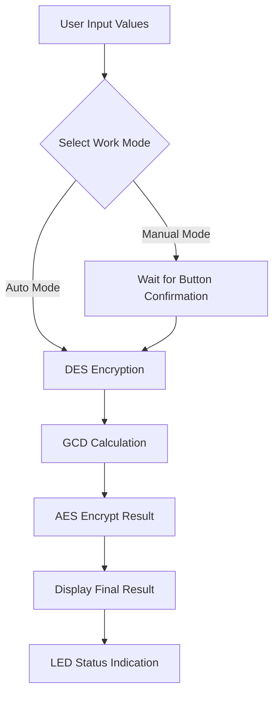

# PYNQ-Z2 Embedded Encryption System Final Project

## Language / 语言
[English](README.md) | [中文](README_zh.md)

## Project Overview 🚀

This project implements a complete embedded encryption system based on the **PYNQ-Z2** development board, integrating multiple encryption algorithm hardware IP cores and providing comprehensive software solutions from Standalone, FreeRTOS to Linux.

### Key Features
- 🔐 **Multiple Encryption Algorithms**: AES-128, DES, GCD Greatest Common Divisor calculation
- ⚡ **Hardware Acceleration**: Custom IP cores for hardware acceleration
- 🔄 **Multi-tier Software Architecture**: Standalone → FreeRTOS → Linux Driver
- 💻 **Complete Development Flow**: From Vivado hardware design to Petalinux system construction
- 📱 **Human-Machine Interface**: LED status indication, button interrupt control

## System Architecture 🏗️

### Hardware Architecture
```
┌─────────────────┐    ┌──────────────────┐    ┌─────────────────┐
│   ARM Cortex-A9 │◄──►│ AXI Interconnect │◄──►│ Custom IP Cores │
│   (PS)          │    │                  │    │                 │
└─────────────────┘    └──────────────────┘    └─────────────────┘
                                │                        │
                       ┌────────▼────────┐       ┌───────▼───────┐
                       │  GPIO & Timer   │       │  AES/DES/GCD  │
                       │  Interrupt Ctrl │       │  INTER IP     │
                       └─────────────────┘       └───────────────┘
```

### IP Core Design
| IP Core | Base Address | Function | Status |
|---------|-------------|----------|--------|
| AES IP | 0x43C10000 | AES-128 Encryption | ✅ Encryption Success / ❌ Decryption Failed |
| DES IP | 0x43C20000 | DES Encryption/Decryption | ✅ Encryption/Decryption Success |
| GCD IP | 0x43C30000 | Greatest Common Divisor | ✅ Operation Normal |
| INTER IP | 0x43C00000 | Interrupt & GPIO Control | ✅ Working Properly |

## Technical Specifications 📋

### Development Environment
- **Hardware Platform**: PYNQ-Z2 Development Board
- **Development Tools**: Vivado 2020.2, Vitis 2020.2, Petalinux 2020.2
- **Operating System**: Xilinx Linux

### System Resources
- **ARM Cortex-A9**: Dual-core 667MHz
- **Memory**: 512MB DDR3
- **Programmable Logic**: Zynq-7000 FPGA
- **Interfaces**: GPIO, UART, Ethernet

## Project Structure 📁

```
final_project/
├── Device_tree/              # Device Tree configuration files
│   ├── system-user.dtsi      # Custom IP device tree configuration
│   ├── system.bit           # FPGA bitstream file
│   └── system.dtb           # Compiled device tree
├── FreeRTOS/                # FreeRTOS multi-task implementation
│   └── testfinalFreeRTOS*/   # Multi-task encryption system
├── IP_information/          # IP core design files
│   ├── AES/                 # AES encryption IP
│   ├── DES/                 # DES encryption IP
│   ├── GCD/                 # GCD calculation IP
│   └── inter/               # Interrupt control IP
├── Linux_driver_and_application/  # Linux driver programs
│   ├── crypto_ips.c         # Main driver program
│   ├── crypto_ioctl.h       # IOCTL interface definition
│   └── work_file/           # Test programs and working files
├── Vitis/                   # Vitis development project
│   └── final/               # Standalone test program
├── vivado/                  # Vivado hardware project
└── picture/                 # Project related images
    └── 1.vivado_circuit.png # Circuit design diagram
```

## Features Demonstration 🎯

### 1. Vivado Hardware Design


### 2. Workflow


### 3. Software Layer Architecture

#### Standalone Application
- **Single-threaded Execution**: Sequential execution of encryption steps
- **Direct Hardware Access**: No operating system overhead
- **Real-time Response**: Suitable for real-time control applications

#### FreeRTOS Multi-task System
```c
// Task Architecture
├── vUserInputTask     // User input processing task
├── vSystemProcessTask // System processing task  
└── vStatusTask        // Status monitoring task
```

#### Linux Driver System
```c
// IOCTL Command Interface
#define CRYPTO_DES_ENCRYPT    _IOWR('c', 3, struct des_operation)
#define CRYPTO_DES_DECRYPT    _IOWR('c', 4, struct des_operation)  
#define CRYPTO_GCD_CALC       _IOWR('c', 5, struct gcd_operation)
#define CRYPTO_AES_ENCRYPT    _IOWR('c', 6, struct aes_operation)
```

## Installation and Usage 🛠️

### 1. Hardware Preparation
- PYNQ-Z2 Development Board
- Micro SD Card (8GB+)
- USB Cable
- Network Cable (Optional)

### 2. Vivado Project Build
```bash
# Open Vivado 2020.2
cd vivado/
vivado project_1.xpr

# Generate bitstream file
# Implementation → Generate Bitstream
```

### 3. Vitis Standalone Application Test
```bash
cd Vitis/final/
# Import project in Vitis and compile
# Download to development board to test IP functions
```

### 4. FreeRTOS Multi-task System
```bash
cd FreeRTOS/testfinalFreeRTOS*/
# Compile and download FreeRTOS application
# Observe multi-task execution effects
```

### 5. Linux Driver Compilation and Loading
```bash
# Compile driver module
cd Linux_driver_and_application/
make

# Load driver
insmod crypto_ips.ko

# Test application
cd work_file/
./crypto_test
```

## Test Results 🧪

### Functional Testing
| Function Module | Test Item | Result | Notes |
|-----------------|-----------|--------|-------|
| DES IP | Encryption Test | ✅ PASS | 64-bit data encryption normal |
| DES IP | Decryption Test | ✅ PASS | Decryption result matches original data |
| GCD IP | Calculation Test | ✅ PASS | 8-bit data calculation correct |
| AES IP | Encryption Test | ✅ PASS | 128-bit data encryption normal |
| AES IP | Decryption Test | ❌ FAIL | Decryption function needs repair |
| INTER IP | Interrupt Test | ✅ PASS | Button interrupt response normal |

### Performance Testing
- **DES Encryption Latency**: < 100ms
- **GCD Calculation Latency**: < 50ms  
- **AES Encryption Latency**: < 200ms
- **Overall System Response Time**: < 500ms

## Known Issues 🐛

### AES Decryption Issue
- **Phenomenon**: AES encryption function works normally, but decryption returns incorrect results
- **Possible Causes**:
  1. IP core decryption mode configuration error
  2. Key expansion algorithm implementation issue
  3. Data format conversion error
- **Status**: Under analysis, encryption function works normally

### Improvement Directions
- [ ] Fix AES decryption function
- [ ] Add RSA encryption support
- [ ] Optimize overall system performance
- [ ] Add graphical user interface

## Development Experience 💭

### Technical Challenges
1. **Hardware-Software Co-design**: Need to master both FPGA design and embedded software development
2. **Multi-tier System Integration**: Complete implementation from bare-metal programs to Linux drivers
3. **Real-time System Design**: FreeRTOS multi-task scheduling and synchronization mechanisms
4. **Driver Development**: Linux kernel module development and debugging

### Summary of Gains
- Deep understanding of complete embedded system development process
- Mastery of Xilinx toolchain usage
- Learning hardware acceleration algorithm design and implementation
- Improved system-level problem analysis and solving capabilities

## Contributing 🤝

Welcome to submit improvement suggestions or Pull Requests to this project:

1. Fork this project
2. Create feature branch (`git checkout -b feature/AmazingFeature`)
3. Commit changes (`git commit -m 'Add some AmazingFeature'`)
4. Push to branch (`git push origin feature/AmazingFeature`)
5. Open Pull Request

## License Information 📄

This project uses MIT License - see [LICENSE](LICENSE) file for details

## Contact Information 📧

- **Project Author**: Embedded Systems Course Students
- **Supervising Professor**: [Professor Name]
- **University**: [University Name]

## Acknowledgments 🙏

Thanks to the following open source projects and resources:
- Xilinx Vivado and Vitis development tools
- OpenCores AES and DES IP core designs
- FreeRTOS real-time operating system
- Linux Kernel driver framework

---

**⭐ If this project helps you, please give it a Star!** 