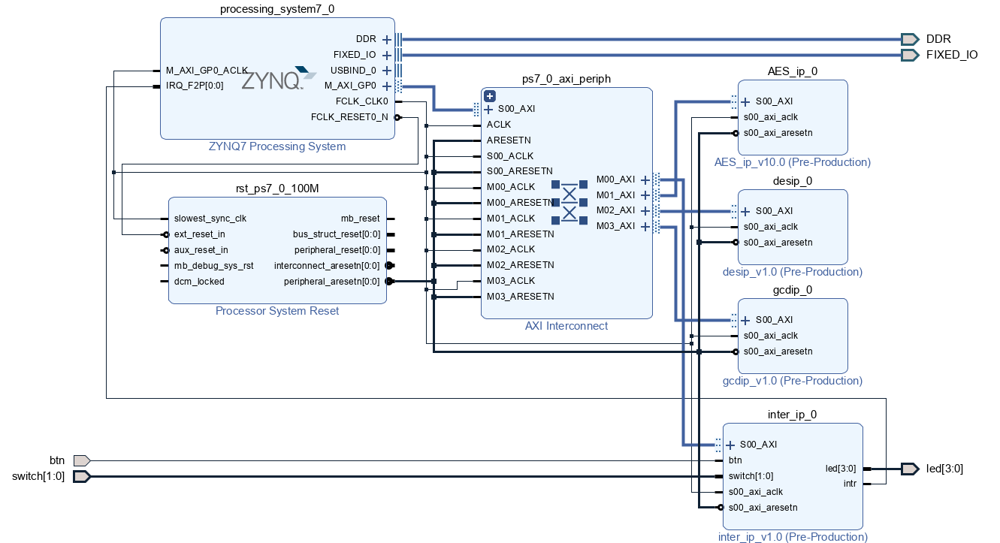
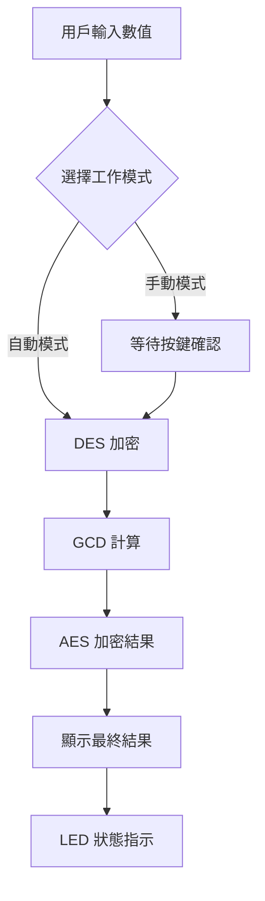

# PYNQ-Z2 嵌入式加密系统期末專題

## Language / 语言
[English](README.md) | [中文](README_zh.md)

## 項目概述 🚀

本專題基於 **PYNQ-Z2** 開發板實現了一個完整的嵌入式加密系統，整合了多種加密算法的硬體 IP 核心，並提供了從 Standalone、FreeRTOS 到 Linux 的完整軟體解決方案。

### 主要特色
- 🔐 **多重加密算法**：AES-128、DES、GCD 最大公因數計算
- ⚡ **硬體加速**：自定義 IP 核心實現硬體加速
- 🔄 **多層級軟體架構**：Standalone → FreeRTOS → Linux Driver
- 💻 **完整開發流程**：從 Vivado 硬體設計到 Petalinux 系統構建
- 📱 **人機介面**：LED 狀態指示、按鍵中斷控制

## 系統架構 🏗️

### 硬體架構
```
┌─────────────────┐    ┌──────────────────┐    ┌─────────────────┐
│   ARM Cortex-A9 │◄──►│ AXI Interconnect │◄──►│ Custom IP Cores │
│   (PS)          │    │                  │    │                 │
└─────────────────┘    └──────────────────┘    └─────────────────┘
                                │                        │
                       ┌────────▼────────┐       ┌───────▼───────┐
                       │  GPIO & Timer   │       │  AES/DES/GCD  │
                       │  Interrupt Ctrl │       │  INTER IP     │
                       └─────────────────┘       └───────────────┘
```

### IP 核心設計
| IP 核心 | 基地址 | 功能 | 狀態 |
|---------|-------|------|------|
| AES IP | 0x43C10000 | AES-128 加密 | ✅ 加密成功 / ❌ 解密失敗 |
| DES IP | 0x43C20000 | DES 加解密 | ✅ 加解密成功 |
| GCD IP | 0x43C30000 | 最大公因數計算 | ✅ 運算正常 |
| INTER IP | 0x43C00000 | 中斷&GPIO控制 | ✅ 運作正常 |

## 技術規格 📋

### 開發環境
- **硬體平台**：PYNQ-Z2 開發板
- **開發工具**：Vivado 2020.2、Vitis 2020.2、Petalinux 2020.2
- **作業系統**：Xilinx Linux

### 系統資源
- **ARM Cortex-A9**：雙核 667MHz
- **記憶體**：512MB DDR3
- **可程式邏輯**：Zynq-7000 FPGA
- **介面**：GPIO、UART、以太網路

## 專案結構 📁

```
final_project/
├── Device_tree/              # Device Tree 設定檔
│   ├── system-user.dtsi      # 自定義 IP 設備樹配置
│   ├── system.bit           # FPGA 位元流檔案
│   └── system.dtb           # 編譯後的設備樹
├── FreeRTOS/                # FreeRTOS 多任務實現
│   └── testfinalFreeRTOS*/   # 多任務加密系統
├── IP_information/          # IP 核心設計檔案
│   ├── AES/                 # AES 加密 IP
│   ├── DES/                 # DES 加密 IP
│   ├── GCD/                 # GCD 計算 IP
│   └── inter/               # 中斷控制 IP
├── Linux_driver_and_application/  # Linux 驅動程式
│   ├── crypto_ips.c         # 主要驅動程式
│   ├── crypto_ioctl.h       # IOCTL 介面定義
│   └── work_file/           # 測試程式和工作檔案
├── Vitis/                   # Vitis 開發專案
│   └── final/               # Standalone 測試程式
├── vivado/                  # Vivado 硬體專案
└── picture/                 # 專案相關圖片
    └── 1.vivado_circuit.png # 電路設計圖
```

## 功能展示 🎯

### 1. Vivado 硬體設計


### 2. 工作流程


### 3. 軟體層級架構

#### Standalone 應用
- **單線程執行**：循序執行各加密步驟
- **直接硬體存取**：無作業系統開銷
- **即時響應**：適合即時控制應用

#### FreeRTOS 多任務系統
```c
// 任務架構
├── vUserInputTask     // 用戶輸入處理任務
├── vSystemProcessTask // 系統處理任務  
└── vStatusTask        // 狀態監控任務
```

#### Linux 驅動系統
```c
// IOCTL 命令接口
#define CRYPTO_DES_ENCRYPT    _IOWR('c', 3, struct des_operation)
#define CRYPTO_DES_DECRYPT    _IOWR('c', 4, struct des_operation)  
#define CRYPTO_GCD_CALC       _IOWR('c', 5, struct gcd_operation)
#define CRYPTO_AES_ENCRYPT    _IOWR('c', 6, struct aes_operation)
```

## 安裝與使用 🛠️

### 1. 硬體準備
- PYNQ-Z2 開發板
- Micro SD 卡 (8GB+)
- USB 線材
- 網路線 (可選)

### 2. Vivado 專案建置
```bash
# 開啟 Vivado 2020.2
cd vivado/
vivado project_1.xpr

# 生成位元流檔案
# Implementation → Generate Bitstream
```

### 3. Vitis 獨立應用測試
```bash
cd Vitis/final/
# 在 Vitis 中導入專案並編譯
# 下載到開發板測試各 IP 功能
```

### 4. FreeRTOS 多任務系統
```bash
cd FreeRTOS/testfinalFreeRTOS*/
# 編譯並下載 FreeRTOS 應用
# 觀察多任務執行效果
```

### 5. Linux 驅動編譯與載入
```bash
# 編譯驅動模組
cd Linux_driver_and_application/
make

# 載入驅動
insmod crypto_ips.ko

# 測試應用程式
cd work_file/
./crypto_test
```

## 測試結果 🧪

### 功能測試
| 功能模組 | 測試項目 | 結果 | 備註 |
|----------|----------|------|------|
| DES IP | 加密測試 | ✅ PASS | 64-bit 數據加密正常 |
| DES IP | 解密測試 | ✅ PASS | 解密結果與原始數據一致 |
| GCD IP | 計算測試 | ✅ PASS | 8-bit 數據計算正確 |
| AES IP | 加密測試 | ✅ PASS | 128-bit 數據加密正常 |
| AES IP | 解密測試 | ❌ FAIL | 解密功能待修復 |
| INTER IP | 中斷測試 | ✅ PASS | 按鍵中斷響應正常 |

### 效能測試
- **DES 加密延遲**：< 100ms
- **GCD 計算延遲**：< 50ms  
- **AES 加密延遲**：< 200ms
- **系統整體響應時間**：< 500ms

## 已知問題 🐛

### AES 解密問題
- **現象**：AES 加密功能正常，但解密返回錯誤結果
- **可能原因**：
  1. IP 核心的解密模式配置錯誤
  2. 密鑰擴展算法實現問題
  3. 數據格式轉換錯誤
- **狀態**：問題分析中，加密功能可正常使用

### 改進方向
- [ ] 修復 AES 解密功能
- [ ] 增加 RSA 加密支援
- [ ] 優化系統整體性能
- [ ] 增加圖形化使用者介面

## 開發心得 💭

### 技術挑戰
1. **硬體軟體協同設計**：需要同時掌握 FPGA 設計和嵌入式軟體開發
2. **多層級系統整合**：從裸機程式到 Linux 驅動的完整實現
3. **即時系統設計**：FreeRTOS 多任務調度和同步機制
4. **驅動程式開發**：Linux kernel 模組的開發和除錯

### 收穫總結
- 深入理解嵌入式系統完整開發流程
- 掌握 Xilinx 工具鏈的使用方法
- 學會硬體加速算法的設計實現
- 提升系統級問題分析和解決能力

## 貢獻指南 🤝

歡迎對本專案提出改進建議或提交 Pull Request：

1. Fork 本專案
2. 創建功能分支 (`git checkout -b feature/AmazingFeature`)
3. 提交更改 (`git commit -m 'Add some AmazingFeature'`)
4. 推送到分支 (`git push origin feature/AmazingFeature`)
5. 開啟 Pull Request

## 授權資訊 📄

本專案採用 MIT 授權 - 詳見 [LICENSE](LICENSE) 檔案

## 聯絡資訊 📧

- **專案作者**：嵌入式系統課程學生
- **指導教授**：[教授姓名]
- **學校**：[學校名稱]

## 致謝 🙏

感謝以下開源專案和資源：
- Xilinx Vivado 和 Vitis 開發工具
- OpenCores AES 和 DES IP 核心設計
- FreeRTOS 即時作業系統
- Linux Kernel 驅動程式框架

---

**⭐ 如果這個專案對您有幫助，請給個 Star！** 